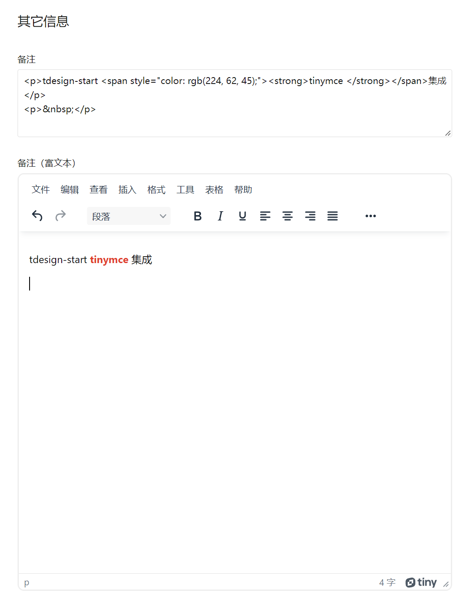

# TinymceEditor 组件说明

封装官方 tinymce-vue 组件，脱离官方云环境(需要注册 apikey 才能使用)，使用自托管 tinymce 来实现富文本编辑器 tinymce 的全部的免费功能

使用最新官方版本：tinymce 6.1.2，tinymce-vue 5.0.0

已配置媒体文件上传钩子，只需要正确配置组件 uploadHandlerUrl

public/tinymce 是从 node_modules/tinymce 拷贝出来的，langs 下 zh-Hans.js 也是官方下载，无任何修改

## 目前组件支持的 props

- selector：编辑器选择器，默认为 textarea
- value：编辑器的值，支持 v-model 语法糖
- baseUrl：编辑器静态资源基础路径，默认：/tinymce，如需修改此目录，也需要同步更新 public 目录下 tinymce 目录名称
- disabled：是否禁用，默认 false
- plugins：插件配置，更多插件配置请参考官方：[https://www.tiny.cloud/docs/tinymce/6/plugins/](https://www.tiny.cloud/docs/tinymce/6/plugins/)
- toolbar：工具栏配置，更多工具栏配置请参考官方：[https://www.tiny.cloud/docs/tinymce/6/toolbar-configuration-options/](https://www.tiny.cloud/docs/tinymce/6/toolbar-configuration-options/)
- width：编辑器宽度，默认：100%
- height：编辑器高度，默认：650
- inline：是否启用行内模式
- menu：是否启用菜单，默认：true，注意：启用行内模式时，menu 自动会变成 false，也即是行内模式 menu 选项无效
- uploadHandlerUrl：接收上传媒体文件的处理 url，接口 response 格式约束：

  ``` js
  // uploadHandlerUrl 接口 response 格式约束：
  {
    "url": '', // 上传成功后资源文件的相对url, 例如：/uploadfiles/images/ss.png
    "absUrl": '', // 上传成功后资源文件的绝对url, 例如：http[s]://xx.com/uploadfiles/images/ss.png
    "data": Object, // 附加数据，本组件无用到
  }
  ```

- theme：编辑器主题样式，支持：light|dark|auto，默认 auto，auto 时，会根据 tdesign-start 设置的显示模式自动切换主题

## 支持的事件

- change：编辑器内容发生变更时触发，参数为编辑器内容

## 使用示例（基础表单：src/pages/form/base/index.vue）

``` html
<template>
  ...
  <t-form-item label="备注" name="comment">
    <t-textarea v-model="formData.comment" :height="124" placeholder="请输入备注" />
  </t-form-item>

  <t-form-item label="备注（富文本）" name="comment">
    <tinymce-editor v-model="formData.comment"></tinymce-editor>
  </t-form-item>
  ...
</template>

<script setup lang="ts">
...
import TinymceEditor from '@/components/tinymce-editor/index.vue';
...
</script>
```

运行效果：


